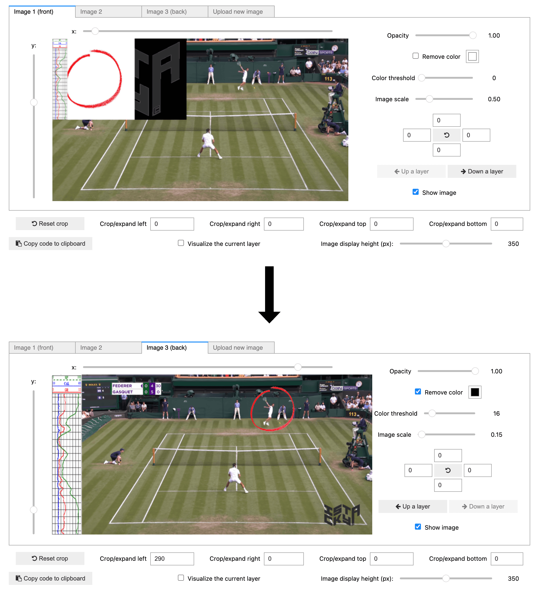

<a name="readme-top"></a>

<div align="center">

[![Contributors][contributors-shield]][contributors-url] [![Forks][forks-shield]][forks-url] [![Stargazers][stars-shield]][stars-url] [![Issues][issues-shield]][issues-url] [![MIT License][license-shield]][license-url] [![LinkedIn][linkedin-shield]][linkedin-url]

</div>

<!-- PROJECT LOGO -->
<br />
<div align="center">
  <a href="https://github.com/antoineedy/istacky">
    
  </a>

<h3 align="center">IStacky</h3>

  <p align="center">
    A lightweight image processing library
    <br />
    <a href="https://github.com/antoineedy/istacky"><strong>Explore the docs »</strong></a>
    <br />
    <br />
    <a href="https://github.com/antoineedy/istacky/blob/main/example.ipynb">View Example</a>
    ·
    <a href="https://github.com/gantoineedy/istacky/issues">Report Bug</a>
    ·
    <a href="https://github.com/antoineedy/istacky/issues">Request Feature</a>
  </p>
</div>

---

## :books: About The Project

<div align="center">

[![Usage of istacky][product-screenshot]](https://github.com/antoineedy/istacky/blob/main/docs/img/gif1.gif)

</div>

__IStacky__ is a __lightweight image processing library__ based on the [Ipywidgets](https://github.com/jupyter-widgets/ipywidgets) library and designed to be used in [Jupyter Notebooks](https://jupyter.org/). The main idea is to provide a __simple__ and __intuitive interface__ to __stack images__ and apply number of modifications to them, such as __cropping__, __resizing__ or __background removal__.

This project has been made to be used in the context of __machine learning__ and __computer vision projects__, where the user needs to __quickly__ and __easily__ create output images that combines several images: plots, photos, logos etc.

<p align="right">(<a href="#readme-top">back to top</a>)</p>


## :technologist: Installation

__:arrow_heading_down: (coming soon) using pip__
```sh
pip install istacky # not working yet!
```

__:twisted_rightwards_arrows: install and run from source code__

Clone the repo, create a virtual environment and install using pip:
```sh
git clone https://github.com/antoineedy/istacky.git
cd istacky
python3 -m venv .
source bin/activate
pip install -e .
```

<p align="right">(<a href="#readme-top">back to top</a>)</p>


<!-- USAGE EXAMPLES -->
## :mag_right: Usage

Istacky is meant to be used in Jupyter Notebooks.

#### :video_camera: Tutorial (coming soon)

#### :notebook: Example

_Have a look at the [example notebook](https://github.com/antoineedy/istacky/blob/main/example.ipynb) for a complete example._

Import the libraries needed:
```python
from PIL import Image
import istacky
```

Load the images we want to stack:
```python
background = Image.open("image/background.png")
img1 = Image.open("image/img1.png")
img2 = Image.open("image/img2.png")
```

Create a `BlendedImage` object and display it:
```python
blended = istacky.BlendedImage(background, [img1, img2])
blended.show()
```


The images are just stacked on top of each other! Let's apply some modifications to them:
```python
blended.editor()
```


Calling editor displays a widget that allows you to apply modifications to the images. You can crop, resize, change the opacity, remove the background, add images, change the orders of the layers etc. 

In our case, we want to put the logo in one corner, circle the pisition of the ball and add a plot of the trajectory of the ball. After the changes, here is the final result:

```python
blended.show()
```


Now, if we want to apply the same modifications to another image, we can have access to the code that was used to create the final image, and apply it to another one:
```python
my_code = blended.get_code()
```
We will use the same background, but different images:
```python
new_img1 = Image.open("image/new_img1.png")
new_img2 = Image.open("image/new_img2.png")
new_img3 = Image.open("image/new_img3.png")
``` 
We specify the code that was used to create the first image, and apply it to the new images:
```python
new_blended = istacky.BlendedImage(
    background=background,
    images = [new_img1, new_img2, new_img3],
    code=my_code
    )
    
new_blended.show()
```


We can see that the modifications have been applied to the new images!


<p align="right">(<a href="#readme-top">back to top</a>)</p>


<!-- ROADMAP -->
## :world_map: Future of the project

I wonder if I (we?) should extend this project to create a Photoshop-like interface using the ipywidgets library. I really don't know any use to this project. Let me know if you have any ideas! See the [open issues](https://github.com/antoineedy/istacky/issues) for a full list of proposed features (and known issues).

<p align="right">(<a href="#readme-top">back to top</a>)</p>


<!-- CONTRIBUTING -->
## :family_man_woman_girl_boy: Contributing

Contributions are what make the open source community such an amazing place to learn, inspire, and create. Any contributions you make are **greatly appreciated**.

If you have a suggestion that would make this better, please fork the repo and create a pull request. You can also simply open an issue with the tag "enhancement".
Don't forget to give the project a star! Thanks again!

1. Fork the Project
2. Create your Feature Branch (`git checkout -b feature/AmazingFeature`)
3. Commit your Changes (`git commit -m 'Add some AmazingFeature'`)
4. Push to the Branch (`git push origin feature/AmazingFeature`)
5. Open a Pull Request

<p align="right">(<a href="#readme-top">back to top</a>)</p>


<!-- LICENSE -->
## :scroll: License

Distributed under the MIT License. See `LICENSE.txt` for more information.

<p align="right">(<a href="#readme-top">back to top</a>)</p>


<!-- CONTACT -->
## :dart: Contact

My name is Antoine EDY. Here is my [LinkedIn](https://www.linkedin.com/in/antoineedy/) and my [Github](https://github.com/antoineedy) profiles, and you can send me an email to [antoineedy@outlook.fr](mailto:antoineedy@outlook.fr).

<p align="right">(<a href="#readme-top">back to top</a>)</p>


<!-- MARKDOWN LINKS & IMAGES -->
<!-- https://www.markdownguide.org/basic-syntax/#reference-style-links -->
[contributors-shield]: https://img.shields.io/github/contributors/antoineedy/istacky?style=for-the-badge
[contributors-url]: https://github.com/antoineedy/istacky/graphs/contributors
[forks-shield]: https://img.shields.io/github/forks/antoineedy/istacky?style=for-the-badge
[forks-url]: https://github.com/antoineedy/istacky/network/members
[stars-shield]: https://img.shields.io/github/stars/antoineedy/istacky?style=for-the-badge
[stars-url]: https://github.com/antoineedy/istacky/stargazers
[issues-shield]: https://img.shields.io/github/issues/antoineedy/istacky?style=for-the-badge
[issues-url]: https://github.com/antoineedy/istacky/issues
[license-shield]: https://img.shields.io/github/license/antoineedy/istacky?style=for-the-badge
[license-url]: https://github.com/antoineedy/istacky/blob/master/LICENSE.txt
[linkedin-shield]: https://img.shields.io/badge/-LinkedIn-black.svg?style=for-the-badge&logo=linkedin&colorB=555
[linkedin-url]: https://linkedin.com/in/antoineedy
[product-screenshot]: docs/img/gif1.gif